<div align="center">
  <h1 align="center">Hi , I'm Aircool 08</h1>
  <b>I'm a Developer/Game Designer/Gangsta Hecker from Germany</b>
</div>

<div align="center">
   
  ✨ Learn more about me on [aircool08.github.io](https://aircool08.github.io). <br>
  💻 Find more of my projects: [github.com/aircool08/repositories](https://github.com/aircool08?tab=repositories). <br>
  💌 You can contact me over Discord: [github.com/aircool08/repositories](https://github.com/aircool08?tab=repositories)
</div>

<div align="center">
  <a href="https://twitter.com/oyepriyansh" target="blank"></a>
  <a href="https://linkedin.com/in/oyepriyansh" target="blank"></a> 
  <a href="https://instagram.com/oyepriyansh" target="blank"></a>
  <a href="https://discord.com/invite/AeAjegXn6D" target="blank"></a>
</div> 
<br>
<div align="center">
  <details>
    <summary>See more</summary>
    <a href="#"></a> <br>
    
    <details open>
      <summary>About me</summary>
      <div align="left">

```javascript
/**
 * Represents me.
 * @constructor
 * @param {string} languages - German, English, Spanish, Javascipt.
 * @param {string} hobbies - Gaming, Coding, Hacking, Guitar.
 * @param {string} interests - DiscordJS, Open Source, Javascript, Java, Catgirls :).
 * @param {Date} birthday - 28th of June.
 */
```
  </div>
</details>


<details open>
  <summary>Discord Status</summary>
  <div>
    <a href="https://discord.com/users/779429650832031774" target="_blank">
      
    </a> <br>
  </div>
</details><details open>
  <summary>GitHub Stats</summary>

  <a href="#"></a><br>

</details>


<details open>


</details>

</details>
  <a href="#"></a>
</div>
